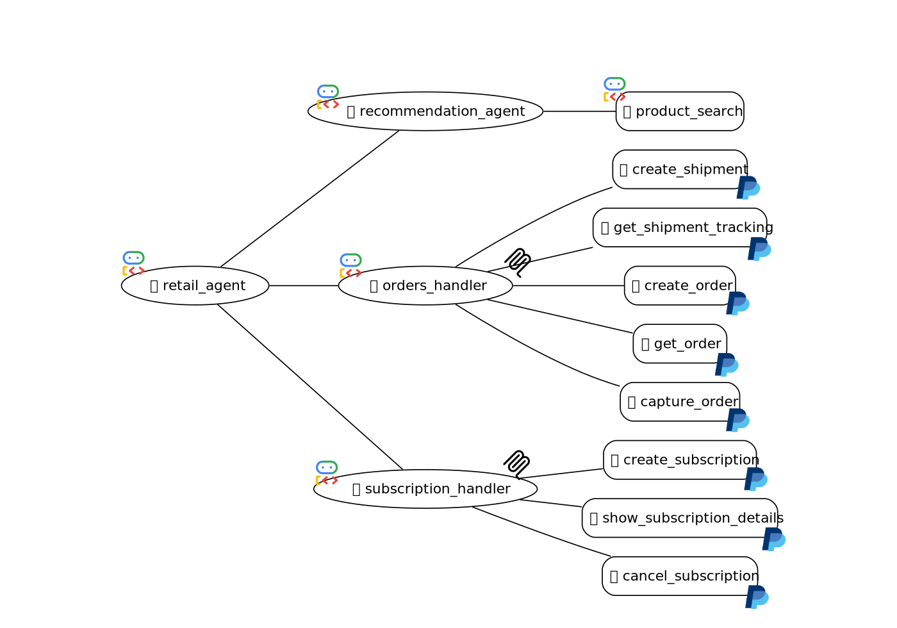
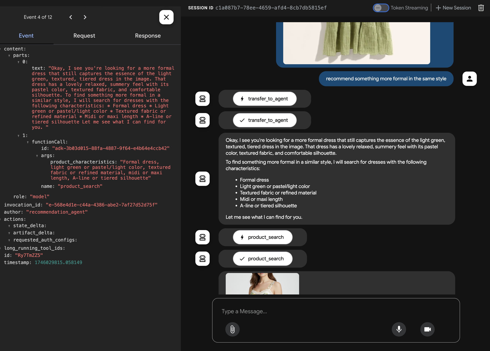
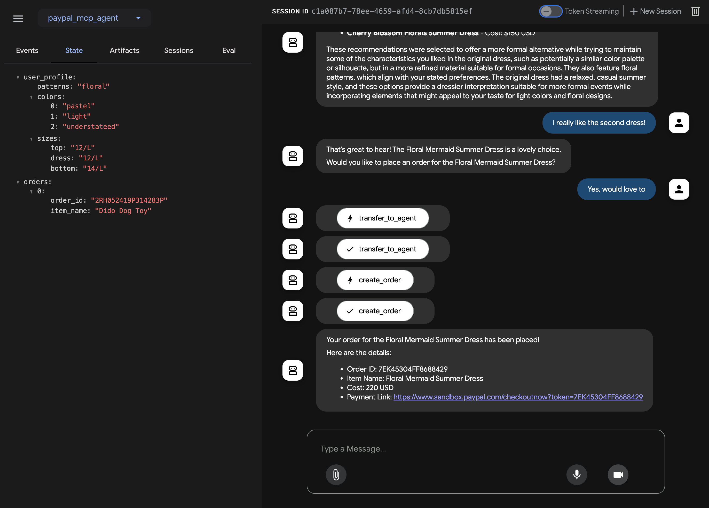

# A commerce-centric demo featuring Agent Development Kit with Paypal Agent Toolkit via MCPs

This 4 minutes demo shows a quick conversational pre-sales engagement using PayPal's [Agent Toolkit](https://github.com/paypal/agent-toolkit) via MCP, and Google's [Agent Development Kit](https://github.com/google/adk-python).

# Paypal Sandbox

When you register with [developer.paypal.com](https://developer.paypal.com/), you can set up multiple Apps, each with will come with its own:
- Client ID and Secret Key for applications calling the APIs.
- A sandbox account with emails and passwords that can log into [sandbox.paypal.com](https://sandbox.paypal.com).
- The sandbox account has test credit cards, addresses and bank details that can be used to test transactions.


# Notes on using the Paypal APIs

## Available APIs
The collection of APIs are primarily merchant centric. There are a total of 25 APIs spanning:
- disputes
- invoices
- orders
- subscriptions
- tracking
- transactions

## In this demo
This demo only obtain the following APIs, they are tested and found functional.
Only orders and shipment are part of the demo:
- 'orders.create',
- 'orders.get',
- 'orders.capture',
- 'shipment.create',
- 'shipment.get',  
- 'subscriptions.create',
- 'subscriptions.show',
- 'subscriptions.cancel'

<div style="position: relative;">
    <div style="position: absolute; top: 0; left: 0; width: 100%; height: 100%; background-color: rgba(255, 255, 255, 1); /* Semi-transparent white background */" ></div>
    
</div>

See `arch/paypal_mcp_adk_a2a.svg` for where remote agents are mentioned at the end of the demo.
Such external agents can be defined and their code lives else where, but via A2A, your agents can make use of the intelligence of these external agents for your customers, without needing to know how they were made.

## API Interdependencies

Here are a list of API interdependencies and operational matters:
- Create order returns a payment URL for the human to log in and pay manually.
- Calling order capture will only be successful once the consumer has completed the transaction.
- A human must create a dispute first in the sandbox environment before a merchant can call accept dispute claim.
- A subscription can only be created if there is a previously created product and a subscription plan.
- There is a delay in list_transactions showing the latest.


# Set up

## Packages
Requires Google adk 0.3.0+:
```
python3 -m venv ~/.ppmcp_adk
source ~/.ppmcp_adk/bin/activate
pip install "google-adk==0.3.0"
pip install "google-cloud-aiplatform==1.90.0"
```

or if poetry is preferred:

```
poetry install
```

## Configuration

COPY 'env.example' into '.env' and set up the '.env` file:
- Fill in either: your [Google API Key](https://ai.google.dev/gemini-api/docs/api-key), or your Google Cloud Project ID and Location
- Find and fill in Paypal Sandbox `PAYPAL_CLIENT_ID` and `PAYPAL_SECRET`

Insert orders info that actually exists in your Paypal sandbox:
- In function `load_user_profile()` within `paypal_mcp_agent/util.py`.
- Modify the `user_profile` and `orders` dictionaries. 
They are loaded during `before_agent_callback`.


# Run ADK Developer UI

1. Run `adk web`, in the working directory `pp_mcp_adk`, where the `.env` file is.
2. It will display `INFO:     Uvicorn running on http://0.0.0.0:8000 (Press CTRL+C to quit)`
3. Point your browser to http://localhost:8000/dev-ui?app=paypal_mcp_agent


# Sample Interaction

**\[User\]**: Where is the dog toy I ordered?

**\[Agent\]**: \[calls get_shipment_tracking API\]

**\[Agent\]**: Your Dido Dog Toy order (ID: 2RH052419P314283P) has been shipped via UPS with tracking number 1Z1234567890123456 on 2025-04-24.

**\[User\]**: how about show me the order information too?

**\[Agent\]**: \[*calls `get_order` API*\]

**\[Agent\]**: Here is the information for your order:
- Order ID: 2RH052419P314283P
- Status: COMPLETED
- Item: Dido Dog Toy
- Quantity: 3
- Total Amount: 30.00 USD
- Shipping Address: 1 Main St, San Jose, CA 95131, US


**\[User\]**: (Manually click on the paperclip icon to the left of the chatbox, load the green dress image into the chat box. The image is under `./paypal_mcp_agent/images`, followed by...) recommend something more formal in the same style.

**\[Agent\]**: Okay, I understand. You're looking for something more formal, but in a similar style to the dress in the image you sent.
...The dress in the image has the following characteristics:

**\[Agent\]**: \[*calls `product_search` tool*\]



...

**\[Agent\]**: I found three dresses that might interest you:

...

**\[User\]**: I like the second dress!

**\[Agent\]**: Great... would you like to order it?

**\[User\]**: Yes, let's do it.

**\[Agent\]**: \[*calls `create_order` API*\]

**\[Agent\]**: Your order for the Floral Mermaid Summer Dress has been placed!

    Here are the details:

    Order ID: 7EK45304FF8688429
    Item Name: Floral Mermaid Summer Dress
    Cost: 220 USD
    Payment Link: https://www.sandbox.paypal.com/checkoutnow?token=7EK45304FF8688429


